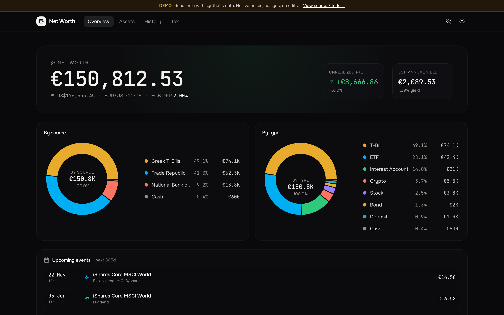
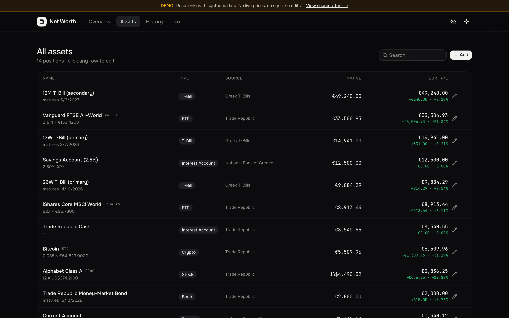
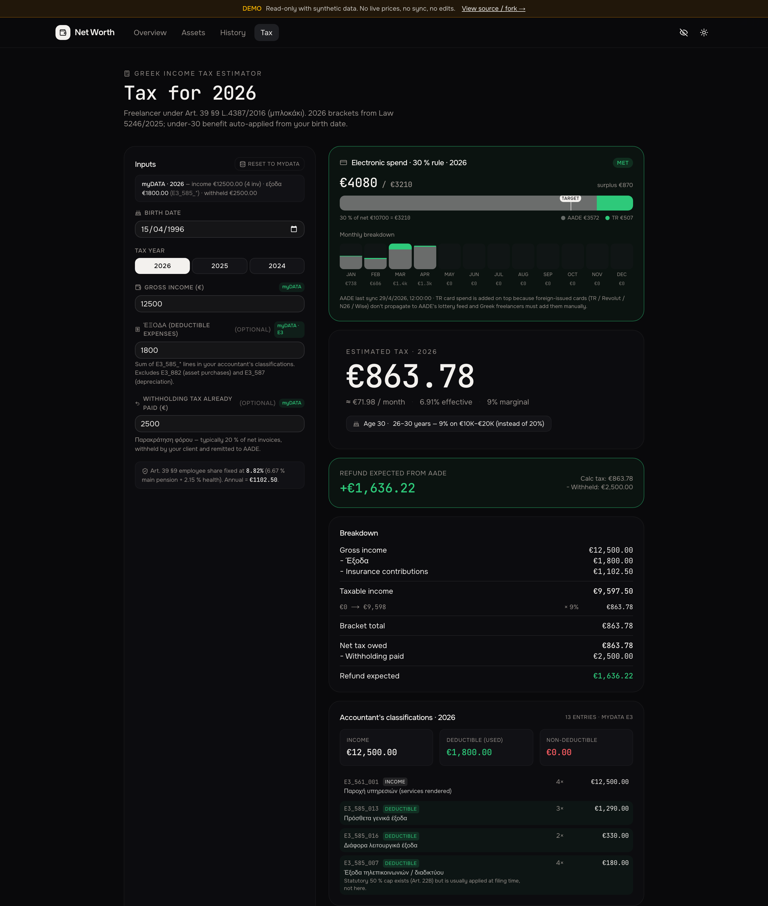
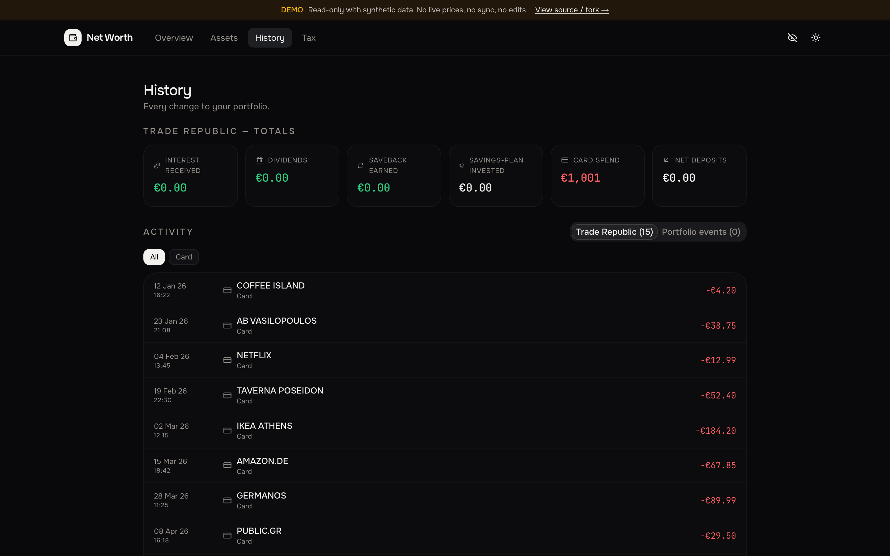
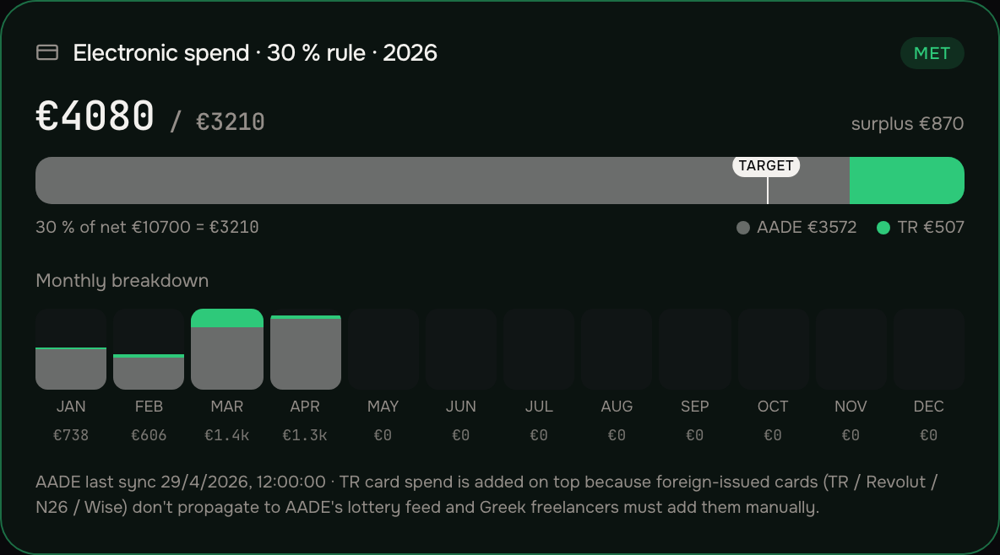

# Personal Portfolio Tracker

A self-hosted dashboard for tracking your net worth across brokers, banks,
T-bills, crypto, and cash — with live prices, automated sync, and per-position
P/L. **All data stays on your own machine.**

[](https://nextjs.org)
[](https://react.dev)
[](https://tailwindcss.com)
[](https://www.typescriptlang.org)
[](https://playwright.dev)
[](https://github.com/milouk/personal-portfolio-tracker/actions/workflows/deploy-demo.yml)
[](https://github.com/milouk/personal-portfolio-tracker/actions/workflows/release.yml)
[](https://github.com/milouk/personal-portfolio-tracker/pkgs/container/personal-portfolio-tracker)
[](https://github.com/milouk/personal-portfolio-tracker/releases/latest)
[](#license)


> 🌐 **Live demo →** [milouk.github.io/personal-portfolio-tracker](https://milouk.github.io/personal-portfolio-tracker)



## Highlights

| | |
| --- | --- |
| 📈 **Live valuations** | ETFs, stocks, crypto and FX update on every page load (Yahoo / Stooq / CoinGecko / ECB). |
| 🏦 **Multi-broker sync** | Pull positions and cash from Trade Republic (pytr) and National Bank of Greece (Playwright). |
| 🇬🇷 **Greek tax estimator** | 2026 brackets, under-30 benefit, Art. 39 §9 freelancer share, 30 % electronic-spend rule. |
| 📅 **Calendar + reminders** | Bond maturities, ex-dividend, dividend-payment dates with email/ntfy push N days ahead. |
| 🔐 **Privacy mode** | One-click blurs every number on screen for screenshots. All data stays local. |
| 🧩 **JSON API** | Drop-in widget for Glance / Homepage / any custom dashboard. |
| 🌗 **Dark / light theme** | Nova preset, readable in both. |
| 🐳 **Docker, multi-arch** | `linux/amd64` and `linux/arm64` images on GHCR, Watchtower-ready. |

## Screenshots

| | |
| --- | --- |
|  |  |
| **Overview** — net worth, allocation donuts, upcoming events. | **Assets** — every position with native + EUR P/L. |
|  |  |
| **Tax** — refund/owed under Law 5246/2025, with the 30 % rule and the accountant's E3 breakdown. | **History** — full TR timeline, categorised (buys / dividends / interest / card spend). |

## Quick start

```bash
git clone https://github.com/<you>/personal-portfolio-tracker
cd personal-portfolio-tracker
npm install
cp .env.example .env.local        # add the credentials you want
npm run dev                       # → http://localhost:3000
```

That's enough to see the empty dashboard. Add assets with the **+ Add asset**
button or by editing `data/portfolio.json` directly.

## Data layout

Everything lives in `data/`:

```text
data/
├── portfolio.json          your assets (single source of truth)
├── events.jsonl            append-only change log
├── prices.json             price cache
├── fx.json                 EUR/USD cache
├── ecb.json                ECB Deposit Facility Rate cache
├── mydata/<year>.json      AADE myDATA snapshot per year
├── aade-card/<year>.json   AADE myAADE monthly card-spend per year
└── tr-transactions.jsonl   full Trade Republic timeline
```

`data/` is git-ignored. Backup = copy the folder.

## Live data sources

| Asset class             | Source            | Refresh   |
| ----------------------- | ----------------- | --------- |
| ETFs / stocks (EUR)     | Yahoo Finance     | 60 s      |
| ETFs / stocks (LSE/USD) | Stooq (fallback)  | 60 s      |
| Crypto                  | CoinGecko         | 60 s      |
| EUR/USD FX              | ECB / Frankfurter | 1 h       |
| ECB rate                | ECB SDW           | 24 h      |
| Greek T-bill auctions   | PDMA              | 24 h      |
| Dividend calendar       | Yahoo             | 24 h      |
| Broker positions / cash | per-broker sync   | on demand |

## Broker sync

Some sources have no public API, so this project drives them with the same
tools you'd use yourself — a Python helper for Trade Republic and a headless
browser for NBG / AADE. Everything runs **only on your machine**, only when
you ask it to.

```bash
npm run sync:tr         # Trade Republic (push / SMS code on first login)
npm run sync:nbg        # National Bank of Greece (Viber OTP each login)
npm run sync:mydata     # AADE myDATA — income / expenses / E3 classifications
npm run sync:aade-card  # AADE myAADE — monthly card-spend (E1 049/050)
npm run sync:all        # all of the above, sequentially
```

Or click **Sync** in the header. When an OTP is needed, a modal pops up — paste
the code and submit. Stale data also auto-fires on page load (TR > 60 s,
NBG > 5 min, AADE card > 12 h).

## Tax estimator

A standalone page at `/tax` that computes Greek personal income tax for the
current and three prior years. Inputs auto-populate from your **myDATA**
snapshot — the same data your accountant uses to file the E3 form:

- **Gross income** ← `RequestMyIncome`
- **Έξοδα** ← sum of `E3_585_*` lines from `RequestE3Info` (i.e. only the
  expenses your accountant has classified as deductible — not raw receipts)
- **Withholding paid** ← `withheldAmount` from `RequestMyIncome`

The estimator applies:

- **2026 brackets** (Law 5246/2025 — 9 / 20 / 26 / 34 / 39 / 44 %) for tax
  year 2026 onwards.
- **2025 brackets** (Law 4646/2019 — 9 / 22 / 28 / 36 / 44 %) for prior years.
- **Under-30 benefit** (Law 5246/2025): 0 % on first €20K for ≤ 25; 9 %
  on the €10K–€20K band for 26–30. Auto-derived from `BIRTH_DATE`.
- **Art. 39 §9 employee share** (8.82 % = 6.67 % main + 2.15 % health) for
  μπλοκάκι freelancers — the client pays the employer share separately.

Verified once against an accountant's pre-filing estimate (€4,255 vs ~€4,200,
**n=1**). Treat as a starting point, not a guarantee — the final filing may
differ for last-minute reclassifications, depreciation lines, charity /
medical / ENFIA deductions not in the model.

### 30 % electronic-spend rule



E1 codes 049/050 require electronic payments equal to **30 % of net business
income** (gross invoices − deductible εξοδα — i.e. πραγματικό εισόδημα,
not gross), capped at €6,000. Shortfall is taxed at 22 %.

The bar uses two sources, stacked:

- **AADE** — what AADE pre-fills from Greek bank reports, scraped via the
  Δημόσια Κλήρωση report (`sync:aade-card`).
- **TR** — Trade Republic merchant card spend, **added on top** because
  foreign-issued cards (TR / Revolut / N26 / Wise) don't propagate to the
  AADE feed and Greek freelancers must add them manually.

The vertical "target" marker on the bar slides as you change income — at €20K
net it locks at the €6,000 cap.

### Setup

```bash
# myDATA REST API — generate at https://www1.aade.gr/saadeapps2/bookkeeper-web
# → "Φόρμα εγγραφής στο myDATA REST API" → "Νέα εγγραφή χρήστη"
AADE_USER_ID=...
AADE_SUBSCRIPTION_KEY=...

# myAADE web scrape (for the 30 % electronic-spend rule)
AADE_TAXISNET_USERNAME=...
AADE_TAXISNET_PASSWORD=...

BIRTH_DATE=YYYY-MM-DD     # for the under-30 benefit
```

Read-only on both APIs: myDATA hits only `RequestMyIncome`,
`RequestMyExpenses`, `RequestE3Info` — never `SendInvoices`, `CancelInvoice`,
or any classification mutator. The myAADE scraper just submits the same
"Εκτύπωση" form the Δημόσια Κλήρωση page exposes interactively. Requires
`pdftotext` (poppler) on the host — `brew install poppler` /
`apt install poppler-utils`. The Docker image bundles it.

## Calendar reminders

The dashboard surfaces upcoming events automatically. To get **email or
ntfy.sh push notifications** N days ahead, add this to a cron job:

```cron
0 9 * * *  cd /path/to/personal-portfolio-tracker && npm run notify:calendar
```

Configure SMTP / ntfy in `.env.local` (see `.env.example`).

## JSON API

Read-only summary + sync triggers — drop into Glance, Homepage, or any custom
dashboard:

| Endpoint        | Method | Purpose                                             |
| --------------- | ------ | --------------------------------------------------- |
| `/api/summary`  | GET    | Net worth, P/L, allocation, FX, ECB                 |
| `/api/prices`   | GET    | Live prices + FX (cached)                           |
| `/api/calendar` | GET    | Upcoming maturities + dividends                     |
| `/api/tbills`   | GET    | Greek T-bill auction calendar                       |
| `/api/sync`     | GET    | Current sync status                                 |
| `/api/sync`     | POST   | Trigger a sync (`tr` / `nbg` / `aade-card` / `all`) |

Set `PORTFOLIO_API_TOKEN` in `.env.local` and pass it via `?token=…`,
`x-api-token: …`, or `Authorization: Bearer …`. With no token configured the
endpoints are open — keep the dashboard on localhost or behind a tunnel.

### Glance widget recipe

```yaml
- type: custom-api
  title: Net worth
  cache: 5m
  url: http://portfolio-tracker:3000/api/summary?token=YOUR_TOKEN
  template: |
    <div style="font-size: 28px; font-weight: 600;">
      €{{ printf "%.0f" (.JSON.Float "totalEur") }}
    </div>
    <div style="opacity: 0.7;">
      P/L {{ if gt (.JSON.Float "gainEur") 0.0 }}+{{ end }}€{{ printf "%.0f" (.JSON.Float "gainEur") }}
      ({{ printf "%.1f" (multiply (.JSON.Float "gainPct") 100.0) }}%)
    </div>
```

## Docker

Multi-arch images (`linux/amd64`, `linux/arm64`) are published on every
release to **GitHub Container Registry**:

```text
ghcr.io/milouk/personal-portfolio-tracker
```

Tags follow semver: each release gets `vX.Y.Z`, `vX.Y`, `vX`, plus `latest`.
Images are public — no `docker login` needed to pull.

### One-line up (pulls from GHCR)

```bash
cp .env.example .env.local       # fill in the vars you actually want
docker compose up -d             # dashboard at http://localhost:3000
```

`compose.yaml` defaults to `ghcr.io/milouk/personal-portfolio-tracker:latest`.
Pin a specific version with `APP_TAG`:

```bash
APP_TAG=v1.2.3 docker compose up -d
```

### Upgrading

Whenever a new release is cut, the new image is on GHCR within minutes.
On your server:

```bash
docker compose pull && docker compose up -d
```

For unattended updates, drop in [Watchtower](https://containrrr.dev/watchtower/)
or run the above as a daily cron job.

### Building locally

If you've patched the source and want to run your local copy:

```bash
docker compose up -d --build      # rebuilds from ./Dockerfile, ignores registry
```

### Passing environment variables

Compose looks at variables in this priority order, so you can mix and match:

1. **Shell** when invoking compose:

   ```bash
   PORTFOLIO_API_TOKEN=xxx docker compose up -d
   ```

2. **`.env`** next to `compose.yaml` (auto-loaded by Docker Compose).
3. **`.env.local`** (loaded into the container via `env_file`, optional).
4. **`environment:`** block in `compose.yaml` (explicit overrides).

All vars from [`.env.example`](.env.example) work in any of those — NBG creds,
TR phone/PIN, SMTP, ntfy, `PORTFOLIO_API_TOKEN`. Anything left unset is treated
as empty (no defaults are baked into the image).

### One-time broker logins

```bash
# Trade Republic — interactive, sends SMS or push to your phone
docker compose run --rm app pytr login

# NBG — interactive, prompts for the Viber OTP
docker compose exec app npm run sync:nbg
```

Sessions are persisted in the named `pytr-home` volume and your local `./data`
directory, so subsequent syncs run without prompts (until the broker invalidates
the session, typically every few weeks).

### Periodic sync (host crontab)

```cron
0 8 * * *  docker compose -f /path/to/compose.yaml exec -T app npm run sync:all
0 9 * * *  docker compose -f /path/to/compose.yaml exec -T app npm run notify:calendar
```

### Headless OTP (no TTY)

When running without an interactive terminal, set `NBG_OTP_SOURCE=webhook`,
expose port 4848 in `compose.yaml`, then deliver the OTP from any phone:

```bash
curl -d 123456 http://your-server:4848/otp
```

## Privacy

- Hide-numbers toggle (eye icon, `⌘/Ctrl + .`) blurs every number on screen.
- All credentials and balances stay local — no cloud, no telemetry.
- `data/` is git-ignored by default.

## Demo

A static-export build with seeded dummy data lives in `demo/`:

```bash
npm run demo:dev      # local preview on :3000
npm run demo:build    # build for GitHub Pages → out/
```

Screenshots in [`docs/screenshots/`](docs/screenshots/) are regenerated by:

```bash
npm run demo:build
npx http-server out -p 3001 &
node scripts/capture-screenshots.mjs
```

## Stack

Next.js 16 · React 19 · Tailwind v4 · shadcn/ui · Recharts · Motion ·
Playwright · pytr · poppler

## License

Personal use. No warranties. PRs welcome.
